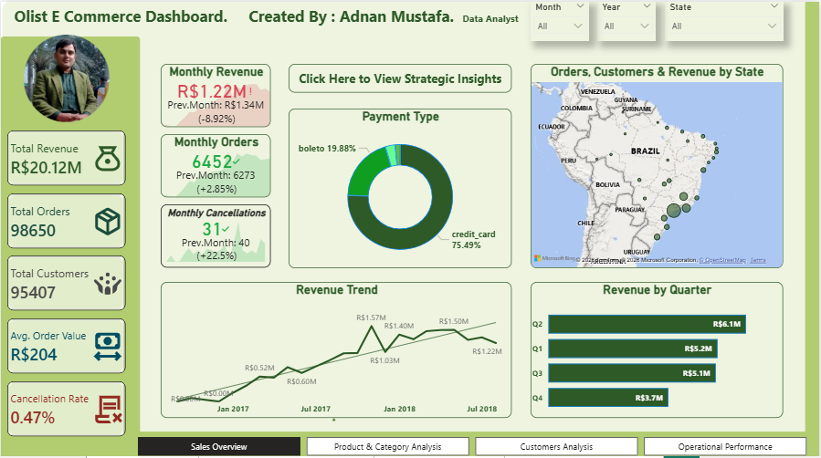
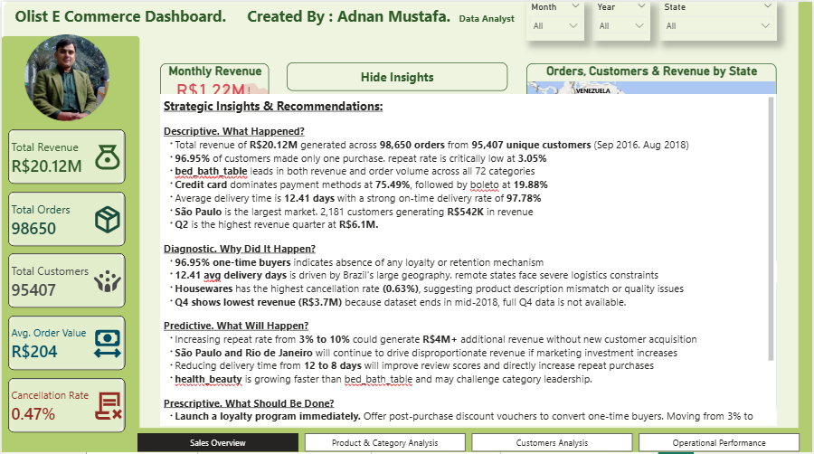
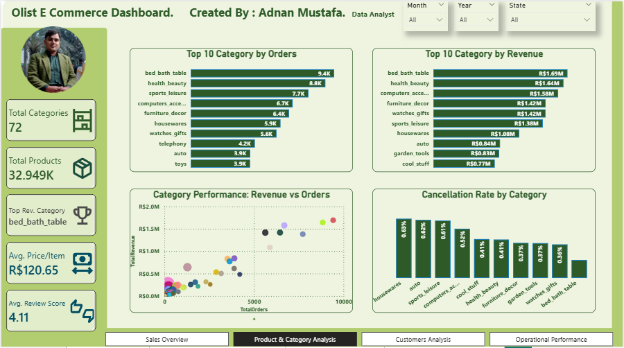
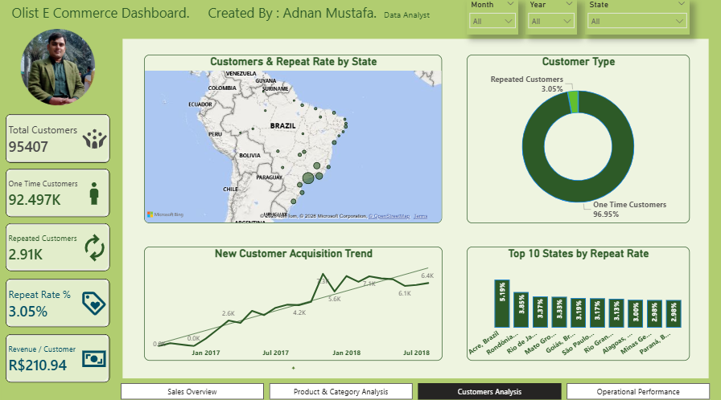
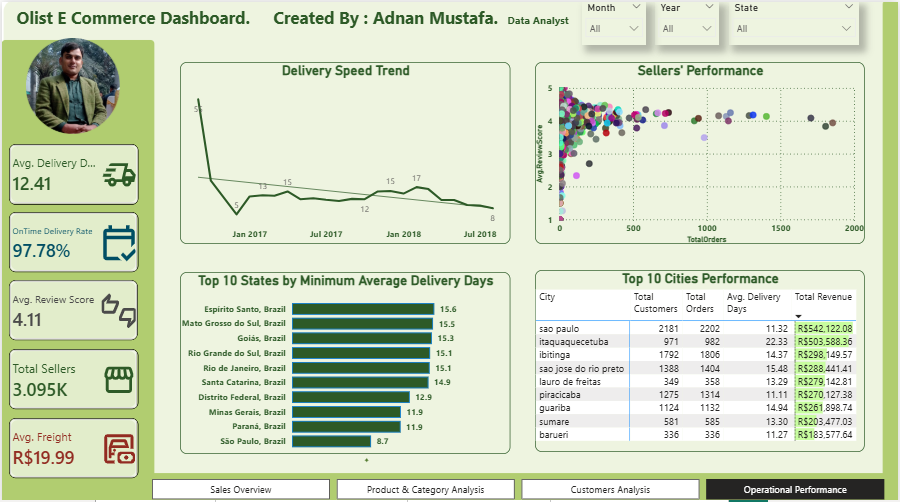

# Olist E-Commerce — End-to-End Data Analytics Project

## Dashboard Preview

### Sales Overview


### Strategic Insights Panel


### Product & Category Analysis


### Customer Analysis


### Operational Performance


> **From 9 raw CSV files to a 4-page interactive business intelligence dashboard — a complete, industry-standard analytics pipeline built on 100,000+ real-world Brazilian e-commerce transactions.**

---

## Project Overview

This project delivers a full end-to-end data analytics workflow using the **Brazilian E-Commerce Public Dataset by Olist** from Kaggle. The dataset contains over **100,000 orders** placed across multiple Brazilian marketplaces between September 2016 and August 2018.

The goal was not just to build a dashboard, but to simulate the exact workflow a **Data Analyst follows in a real industry environment**: multi-source data ingestion, rigorous cleaning, cloud database storage, dimensional modeling, and executive-level business intelligence reporting — including a mobile-optimized layout.

---

## Business Questions Answered

- What is the total revenue, and how does it trend over time?
- Which product categories drive the most revenue and orders?
- How many customers are one-time buyers vs. repeat customers?
- What is the repeat rate, and which states have the highest loyalty?
- How efficient is the delivery operation, and which states face delays?
- Which sellers generate the most revenue and maintain the best review scores?
- What payment methods do customers prefer?
- Is the business meeting its monthly revenue and order targets?

---

## Tools & Technologies

| Layer | Tool |
|-------|------|
| Data Cleaning & Validation | Python (Pandas) |
| Cloud Database | MySQL on Aiven Console |
| Data Modeling | Star Schema (Power BI Data Model) |
| Business Intelligence | Microsoft Power BI |
| Version Control | GitHub |

---

## Project Architecture

```
Kaggle Dataset (9 CSV Files)
        ↓
Python (Pandas) — Data Cleaning, Merging & Validation
        ↓
MySQL on Aiven Console — Cloud Table Storage
        ↓
Power BI — Star Schema Modeling, DAX Measures & Dashboard
        ↓
Business Insights & Strategic Recommendations
```

---

## Phase 1: Data Cleaning (Python)

**Dataset:** 9 CSV files — orders, customers, order_items, order_payments, order_reviews, products, sellers, geolocation, category_translation

### Issues Identified & Resolved

| Issue | Action Taken |
|-------|-------------|
| Missing product category names | Filled with 'Unknown' |
| 2 rows with null product dimensions | Dropped |
| Portuguese category names | Translated to English using category_translation table |
| Duplicate reviews per order | Kept highest review score per order |
| 18 order items with no matching product | Removed to maintain referential integrity |
| Brazilian state codes (SP, RJ etc.) | Mapped to full state names with ", Brazil" suffix for accurate map rendering |
| Payment data: multiple rows per order | Kept primary payment type per order (highest value) |

### Key Engineering Decisions

- **customer_unique_id** was used as CustomerID instead of customer_id, because customer_id is a per-order identifier, not a true customer identifier. This ensures accurate customer-level analysis.
- **PaymentType** column was added to Sales_Data to enable payment method analysis directly from the fact table.
- **State names** were standardized to full names (e.g., "São Paulo, Brazil") to ensure Power BI map visual renders all data points correctly within Brazil.

---

## Phase 2: Cloud Database (MySQL on Aiven Console)

### Why Aiven Console MySQL?

Aiven provides a managed cloud MySQL instance, simulating the real-world scenario where data resides in a cloud database rather than local files. Cleaned data was loaded into MySQL using Python SQLAlchemy in **10,000-row chunks** to handle cloud connection constraints. Data quality was validated with health check SQL queries before connecting to Power BI.

### Star Schema Design

```
                    ┌──────────────────┐
                    │  Calendar_Lookup  │
                    │  (DAX — Power BI) │
                    └────────┬─────────┘
                             │ 1
                             │
┌──────────────┐    *        │        1    ┌──────────────────┐
│Product_Lookup├────────────┤─────────────┤ Customer_Lookup  │
│ (ProductID,  │            │             │ (CustomerID,     │
│  Category)   │      ┌─────┴──────┐      │  City, State)    │
└──────────────┘      │ Sales_Data │      └──────────────────┘
                      │  (FACT)    │
                      │            │      ┌──────────────────┐
                      │ OrderID    │  1   │  Seller_Lookup   │
                      │ ProductID  ├──────┤ (SellerID,       │
                      │ SellerID   │      │  City, State)    │
                      │ CustomerID │      └──────────────────┘
                      │ OrderDate  │
                      │ OrderStatus│      ┌──────────────────┐
                      │ PaymentType│  *   │  Reviews_Lookup  │
                      │ PaymentValue├─────┤ (OrderID,        │
                      │ Price      │      │  ReviewScore,    │
                      │ FreightValue│     │  ReviewDate)     │
                      └────────────┘      └──────────────────┘
```

### Tables in MySQL

| Table | Rows | Purpose |
|-------|------|---------|
| Sales_Data | 112,632 | Fact table |
| Customer_Lookup | 96,096 | Customer dimension |
| Product_Lookup | 32,949 | Product dimension |
| Seller_Lookup | 3,095 | Seller dimension |
| Reviews_Lookup | 97,901 | Reviews dimension |

> **Note:** Calendar_Lookup was built directly in Power BI using DAX (ADDCOLUMNS + CALENDAR function), as date intelligence tables are commonly managed at the BI layer.

---

## Phase 3: Power BI Dashboard

### Data Model

- Calendar_Lookup → Sales_Data (on Date → OrderDate) — One to Many
- Customer_Lookup → Sales_Data (on CustomerID) — One to Many
- Product_Lookup → Sales_Data (on ProductID) — One to Many
- Seller_Lookup → Sales_Data (on SellerID) — One to Many
- Sales_Data → Reviews_Lookup (on OrderID) — One to Many

### Key DAX Measures

```dax
Total Revenue = SUM(Sales_Data[PaymentValue])

Total Orders = DISTINCTCOUNT(Sales_Data[OrderID])

Total Customers = DISTINCTCOUNT(Sales_Data[CustomerID])

Avg Order Value = DIVIDE([Total Revenue], [Total Orders])

Cancellation Rate = 
DIVIDE(
    CALCULATE([Total Orders], Sales_Data[OrderStatus] = "canceled"),
    [Total Orders]
)

Avg Delivery Days = 
AVERAGEX(
    FILTER(Sales_Data, Sales_Data[OrderStatus] = "delivered"),
    DATEDIFF(Sales_Data[OrderDate], Sales_Data[DeliveryDate], DAY)
)

On Time Delivery Rate = 
DIVIDE(
    CALCULATE([Total Orders], Sales_Data[OrderStatus] = "delivered"),
    [Total Orders]
)

Repeat Customers = 
COUNTROWS(
    FILTER(
        VALUES(Sales_Data[CustomerID]),
        CALCULATE(DISTINCTCOUNT(Sales_Data[OrderID])) > 1
    )
)

Repeat Rate % = DIVIDE([Repeat Customers], [Total Customers])

Prev Month Revenue = 
CALCULATE([Total Revenue], PREVIOUSMONTH(Calendar_Lookup[Date]))

Monthly Revenue Target = [Prev Month Revenue] * 1.10

Revenue Growth % = 
DIVIDE([Total Revenue] - [Prev Month Revenue], [Prev Month Revenue])
```

### Dashboard Pages

**Page 1 — Sales Overview**
- KPI Cards: Total Revenue, Total Orders, Total Customers, Avg Order Value, Cancellation Rate
- Smart KPI Cards: Monthly Revenue, Monthly Orders, Monthly Cancellations (with previous month comparison)
- Line Chart: Revenue Trend (Sep 2016 — Aug 2018)
- Bar Chart: Revenue by Quarter
- Map: Orders, Customers & Revenue by State
- Donut Chart: Payment Type Distribution
- Toggle Insights Panel: Full strategic analysis built using Power BI Bookmarks

**Page 2 — Product & Category Analysis**
- KPI Cards: Total Categories, Total Products, Top Revenue Category, Avg Price/Item, Avg Review Score
- Bar Chart: Top 10 Categories by Orders
- Bar Chart: Top 10 Categories by Revenue
- Scatter Plot: Category Performance — Revenue vs Orders
- Bar Chart: Cancellation Rate by Category

**Page 3 — Customer Analysis**
- KPI Cards: Total Customers, One-Time Customers, Repeated Customers, Repeat Rate %, Revenue/Customer
- Map: Customers & Repeat Rate by State
- Donut Chart: Customer Type Distribution
- Line Chart: New Customer Acquisition Trend
- Bar Chart: Top 10 States by Repeat Rate

**Page 4 — Operational Performance**
- KPI Cards: Avg Delivery Days, On-Time Delivery Rate, Avg Review Score, Total Sellers, Avg Freight
- Line Chart: Delivery Speed Trend
- Scatter Plot: Sellers Performance — Total Orders vs Avg Review Score
- Bar Chart: Top 10 States by Avg Delivery Days
- Table: Top 10 Cities Performance

**Strategic Insights Panel**
An interactive toggle button on the Sales Overview page allows users to show or hide a full strategic analysis panel on demand, covering Descriptive, Diagnostic, Predictive, and Prescriptive insights. Built using Power BI Bookmarks and Selection pane. A mobile-optimized layout is included for all 4 pages.

---

## Key Insights & Recommendations

### Descriptive — What Happened?
Total revenue of R$20.12M generated across 98,650 orders from 95,407 unique customers (Sep 2016 — Aug 2018). 96.95% of customers made only one purchase. bed_bath_table leads in both revenue and order volume across all 72 categories. Credit card dominates at 75.49%. Average delivery time is 12.41 days with a 97.78% on-time delivery rate.

### Diagnostic — Why Did It Happen?
96.95% one-time buyers indicates a complete absence of any loyalty or retention mechanism. 12.41 avg delivery days is driven by Brazil's large geography. Housewares has the highest cancellation rate (0.63%), suggesting product description mismatch or quality issues. Q4 shows lowest revenue because the dataset ends in mid-2018 and full Q4 data is not available.

### Predictive — What Will Happen?
Increasing repeat rate from 3% to 10% could generate R$4M+ additional revenue without new customer acquisition. São Paulo and Rio de Janeiro will continue to drive disproportionate revenue. Reducing delivery time from 12 to 8 days will improve review scores and repeat purchases. health_beauty is growing faster than bed_bath_table and may challenge category leadership.

### Prescriptive — What Should Be Done?
Launch a loyalty program immediately with post-purchase discount vouchers. Prioritize São Paulo and Rio de Janeiro with 60% of marketing budget. Audit the Housewares category to reduce the highest cancellation rate. Invest in regional warehouses in remote states to cut delivery time. Promote 4-6 installment plans to mid-value customer segments to unlock higher spend.

---

## Repository Structure

```
Olist-Ecommerce/
│
├── python/
│   └── Olist_Ecommerce.ipynb        # Data cleaning & MySQL upload notebook
│
├── sql/
│   └── health_check.sql             # Data quality validation queries
│
├── assets/
│   ├── sales_overview.png
│   ├── insights_panel.png
│   ├── product_analysis.png
│   ├── customer_analysis.png
│   └── operational_performance.png
│
└── README.md
```

> **Note:** The Power BI (.pbix) file is not included in this repository as it contains database credentials. To reproduce, connect Power BI to your own MySQL instance using the schema defined in this README.

---

## How to Reproduce

1. Download the dataset from [Kaggle — Brazilian E-Commerce Public Dataset by Olist](https://www.kaggle.com/datasets/olistbr/brazilian-ecommerce)
2. Upload the zip file to Google Drive
3. Open `python/Olist_Ecommerce.ipynb` in Google Colab and mount your Drive
4. Update the MySQL connection string with your own Aiven credentials
5. Run all cells to clean data and upload to MySQL
6. Open Power BI Desktop and connect to your MySQL database
7. Recreate the Calendar_Lookup table using the DAX formula in Phase 3
8. Build relationships as defined in the Data Model section
9. Refresh the data and explore the dashboard

---

## Author

**Adnan Mustafa**
Data Analyst

---

## Dataset Source

- **Name:** Brazilian E-Commerce Public Dataset by Olist
- **Source:** [Kaggle](https://www.kaggle.com/datasets/olistbr/brazilian-ecommerce)
- **License:** CC BY-NC-SA 4.0
